# Avocado Kitchen - A Smart Meal Plan App

This application allows the user to manage their weekly meal plan, and algorithmically formulates plans based on nutrition, user diet restrictions, and adjustable budget. Users can create and upload their own recipes to a community, where other users can like, comment, and download/modify the recipe for themselves. The application also automatically tracks recipe ingredients and, with the user's permission, auto-orders them from South Korea's Coupang and MarketKurly online stores. 

## Periods of Development  
- April 23, 2022 - Present

## Development Environment  
- 'NodeJS, React Native, TailwindCSS, Python' 
- 'Database: Google Firebase'

## Figma Pre-Design

A majority of the current progress was spent on developing the front-end application for usability, navigability, and aesthetics. The initial designs of each major page were drafted on Figma, where aspects like the color palette, page layout, and general navigation was experimented. More pages were added throughout the process as the app expanded in functionality and pages. 

   
   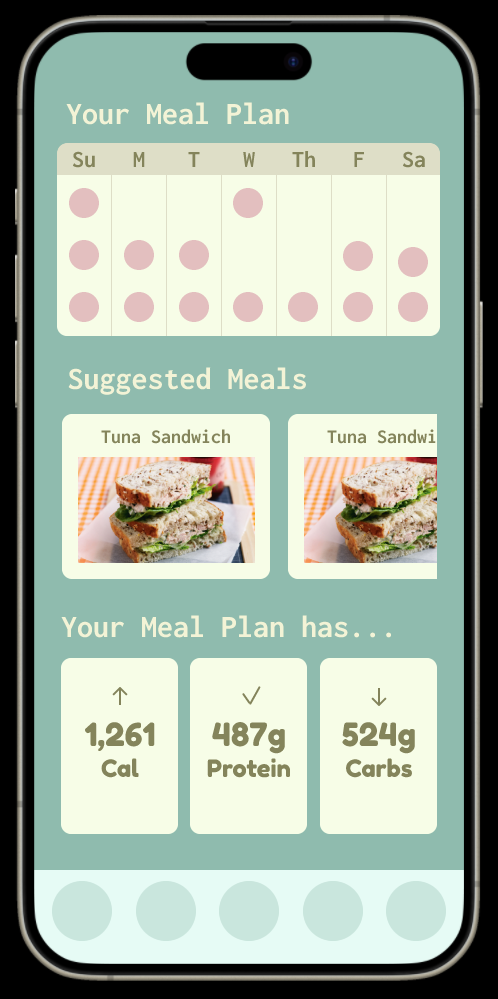

Note that a large portion of the general navigation and widgets were edited during front-end development. The [Figma link](https://www.figma.com/design/Eqfgi0TAOecSLGTEpJMXLM/Meal-Plan-App?node-id=0-1&p=f&t=kHnIiwVHbvht7x5v-0) is provided if more in-depth exploration is desired. 

## Front-End Development

Since the application is mainly intended for Korean consumers, both English and Korean had to be considered for application content. The application itself was made to automatically display Korean if the system language was set to Korean, and English otherwise. 

### Login/SignUp Page

The first page created on the application was the login and signup page. The user is identified via their email and verified with a password, both of which are stored in an online database. The user also has the option to sign up, or sign in via Google, which utilizes the Google OAuth 2.0 url verification. Once ready, the user can click the login button to proceed to the homepage. 

   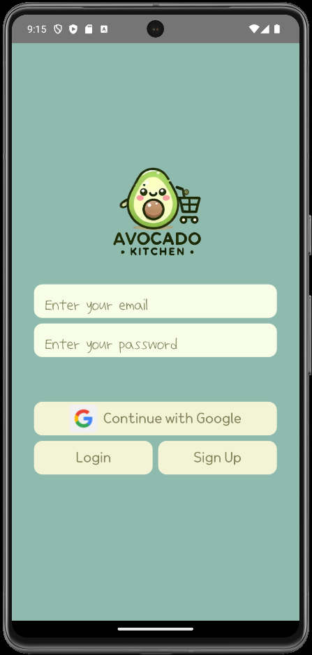
   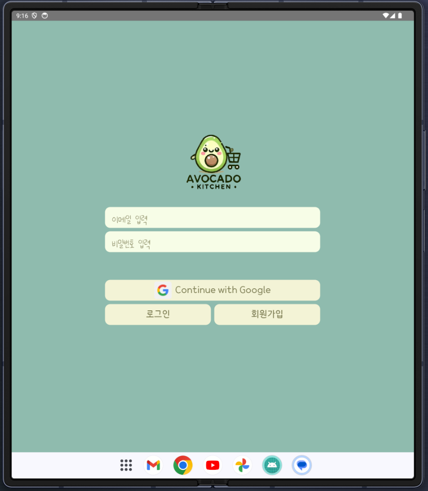

### HomePage

The application homepage serves as an overview of the user's meal plan for the day/week. The first widget outlines the three meals for each day of the week and their calories. A scrollable list of suggested meals are displayed as cards underneath. Finally, the weekly meal plan's nutrition information, such as its total calories, protein, and carbs, is outlined at the bottom. Icons indicate whether the nutrition values are sufficient, or need to be supplemented/reduced. 

   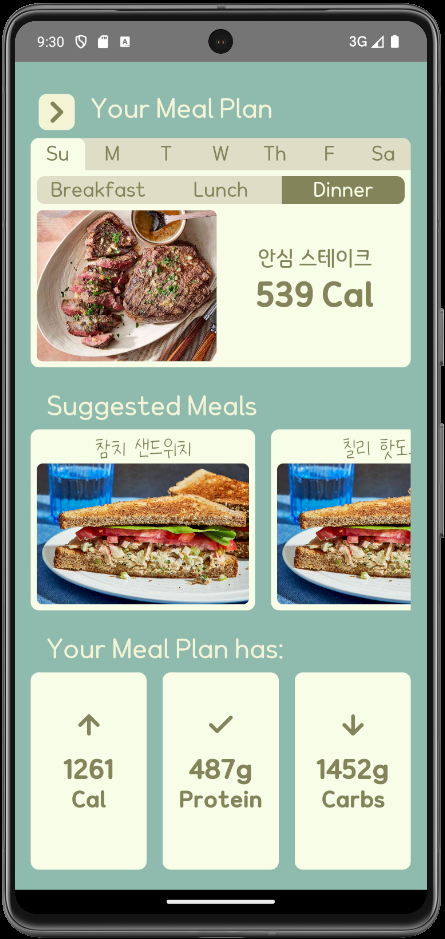
   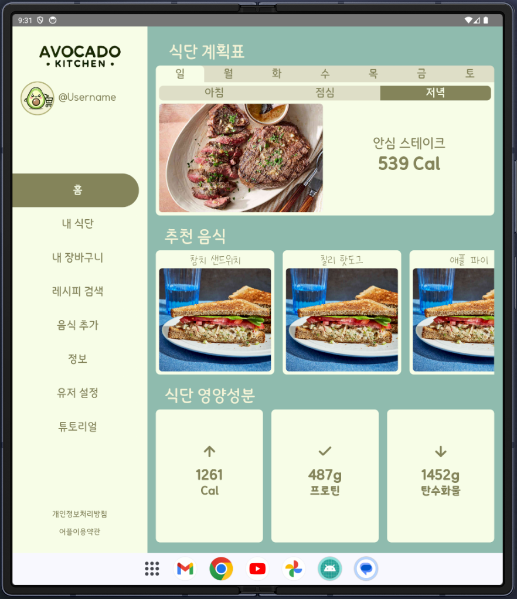

### Sidebar Navigation

Different pages of the application can be navigated by the sidebar. On a regular phone screen, the sidebar is accessed via the sidebar button at the top left of every page. For screens with wider aspect ratios, the sidebar is permanently present on the left-hand side of the screen. 

   
   

### Profile/Settings Page

The profile/settings page is where the user can adjust their dietary restrictions, such as specific diets or allergies. The user can also adjust their per meal, daily, or weekly budget. All the above is taken into account when automatically computing the user's weekly meal plan. The user can also link their Coupang/MarketKurly accounts if they wish to allow auto-ordering ingredients from those online stores. 

   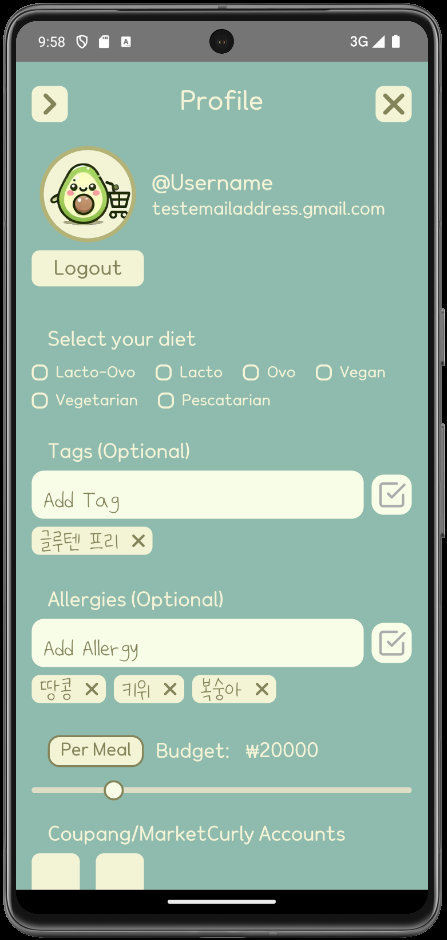
   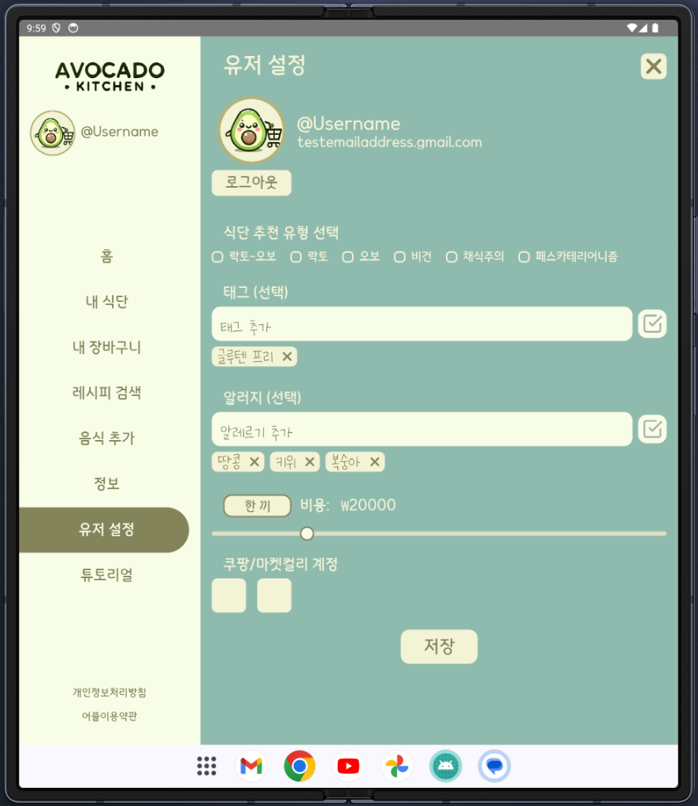

For pages such as the profile/settings page where user edit is possible/encouraged, the application double-checks whenever a user requests to leave the screen via a popup.

   
   

### Information Page

NEED TO ADD

### Meal Plan Page

The meal plan page is a more detailed overview of each meal included in the user's meal plan, and serves as an extension of the first widget in the homepage. This page includes additional features such as the user being able to edit and (delete???) specific meals. The meal plan page also includes a similar nutritional summary as the homepage, but shows the average daily nutrition for that meal plan instead of statistics for that specific day. 

   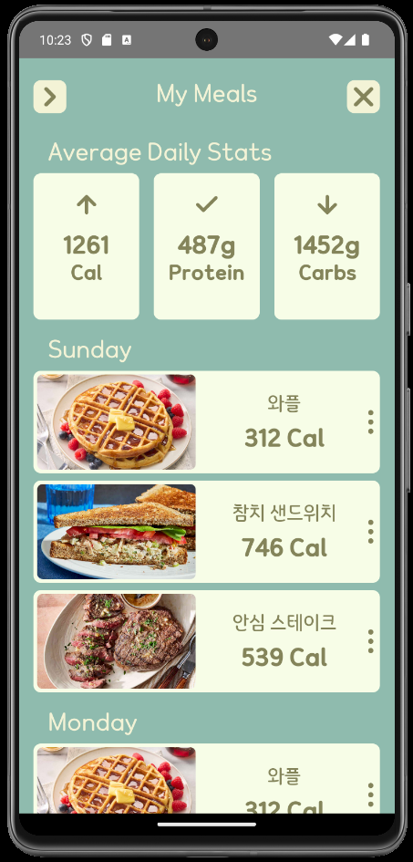
   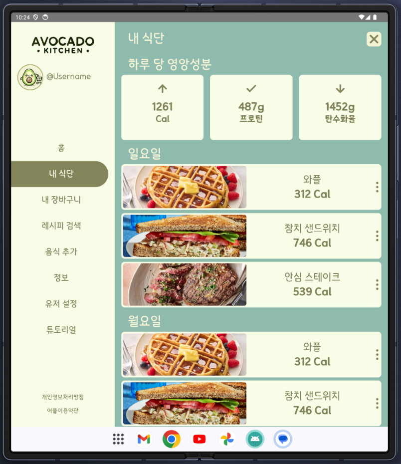

### Add Meal Page

The add meal plage is where the user can add specific meals to their meal plan. They can select a specific day/meal, and manually input fields such as meal name, ingredients, and recipe steps. More conveniently, the user can also directly add existing recipes to their meal plan (explained later). This will auto fill the add meal page with the recipe information, which the user can edit to their liking. Once finished, the next page shows a budget estimation for online ordering, and allows the user to add additional tags or confirm whether they want their recipe published. 

   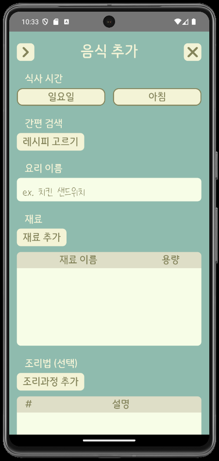
   

#### Add Ingredients Page

If the user wants to add a specific ingredient, they can utilize the "Quick Search" feature by inputting ingredients into the top search bar. This queries Coupang/MarketKurly for relevant items, and selecting them will auto fill the ingredients page. The user can also manually input ingredient information, as well as optionally provide a Coupang/MarketKurly link that the application will use to auto-order, if the user desires. 

   
   

#### Add Recipe Step Page

When adding recipe steps, the user can use a counter to specify which recipe step they wish to add. They are also allowed to add recipe descriptions of any length (may perhaps change later to scale), and upload images (encoded in base64). 

   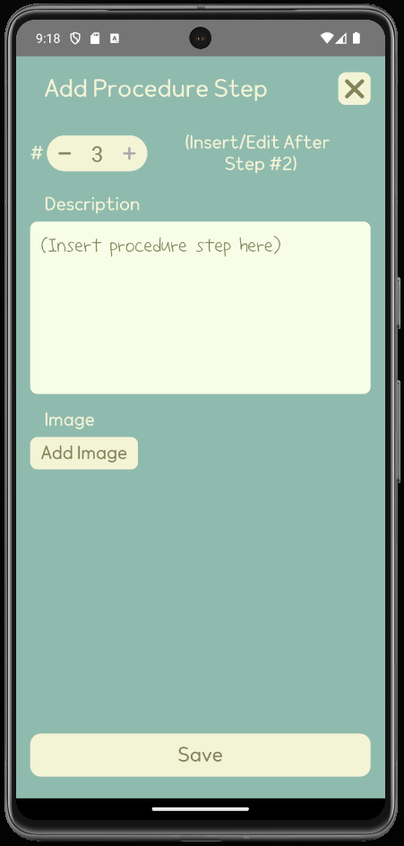
   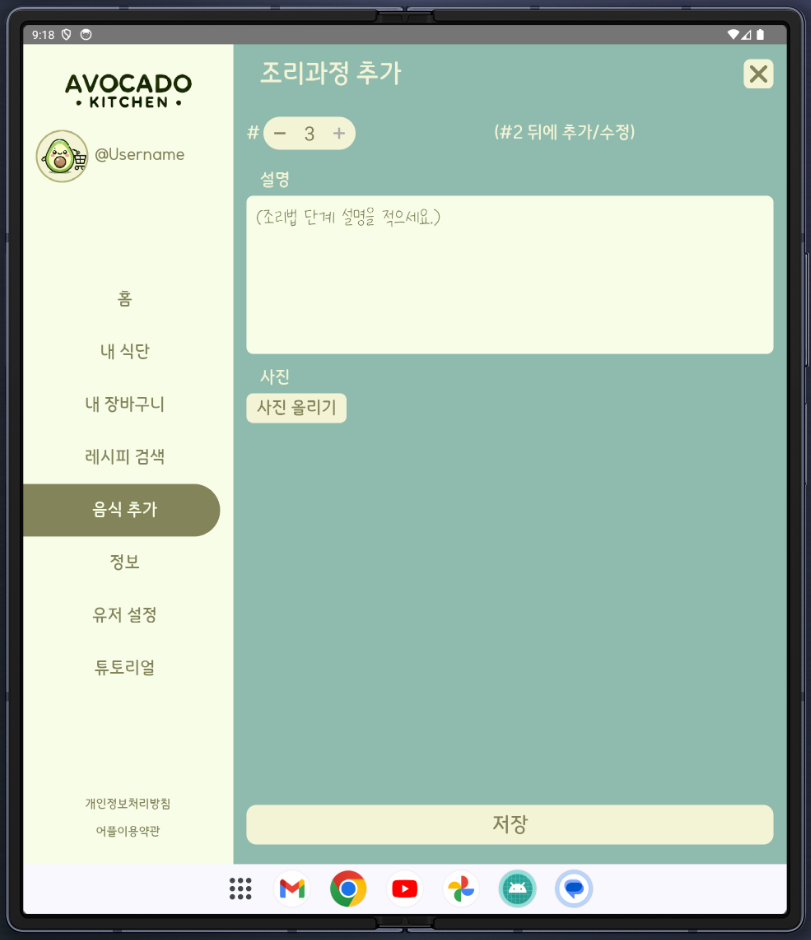

### Recipe Search Page

The recipe browse page allows the user to browse recipes uploaded by other users in the community through a search bar at the top. The user can also open up option menus, where they can filter for specific diets, calorie/budget ranges, select whether to search by recipe name, users, or tags, and filter/order the results. A list of recipes will be displayed underneath the search bar as cards, split into multiple pages if necessary. 

   
   

Clicking a recipe card will navigate to a recipe page, with the recipe name, a table of ingredients, and procedure cards. The user can scroll through the ingredients table and select a specific row, where an ingredient card will pop up explaining the ingredient in detail. The user can also scroll through the recipe cards, and select each card to expand the recipe card for easier viewing. 

   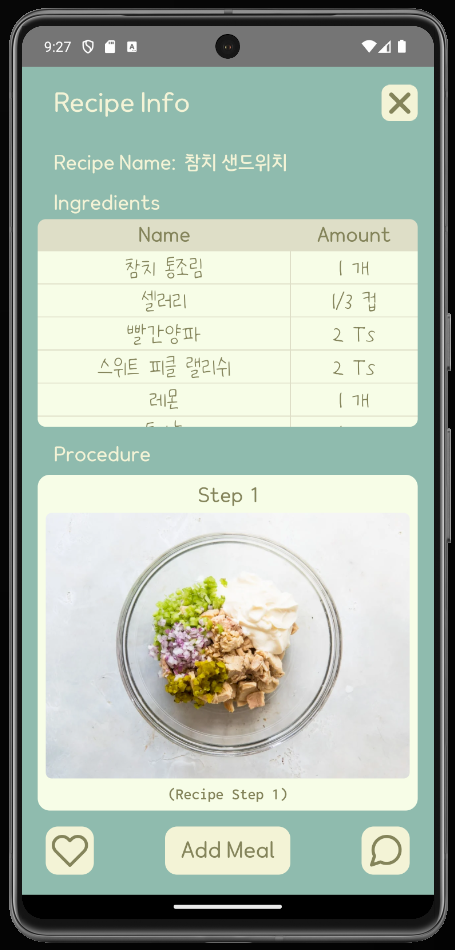
   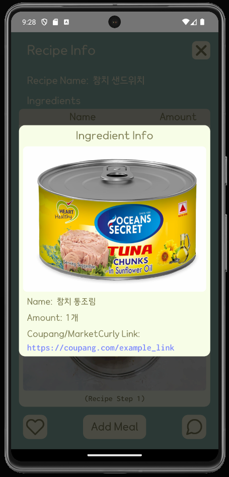
   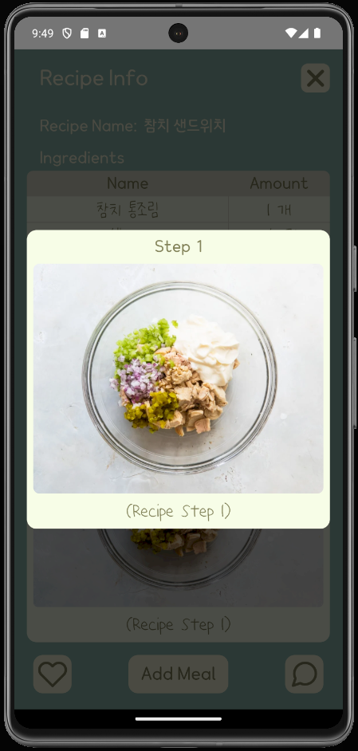

The recipe page also has buttons on the bottom for the user to further interact with the recipe. The user can like the recipe by clicking the heart icon, or navigate to the comment section by clicking the comment button. This will bring up a comment popup where the user can read and post comments. 

Crucially, the user can select "Add Meal" to add the recipe to their own meal plan. Clicking this button will navigate to the Add Meal Page, which will be auto-completed with the recipe information. The user is free to edit the recipe before adding it to their own meal plan (which will work identically as before). 

   
   

### My Cart Page

The cart page parses through the user's recipes and automatically displays the ingredients the user needs to buy from the Coupang/MarketKurly online stores in a table. The user can edit each ingredient's contents or count, or add new ingredients as they see fit. When adding ingredients, available options are read from the Coupang/MarketKurly stores, and each item's prices and delivery dates/methods are outlined. The total cost of ingredients is calculate for each store, and the final cost is displayed below. If the total is over the user's selected weekly budget, it is highlighted in red; otherwise, it is highlighted in green. 

   
   

The application avoids buying unnecessary ingredients by considering which items the user has in their fridge. Similarly to the cart page, the user is able to edit the amount of items, or add/remove items from their fridge. When adding items, the user will query from a list of consumer ingredients, sourced from a public [XML dataset](https://www.data.go.kr/data/15127578/openapi.do#/API%20%EB%AA%A9%EB%A1%9D/getFoodNtrCpntDbInq01) provided by the South Korean [Ministry of Food and Drug Safety](https://various.foodsafetykorea.go.kr/nutrient/). The application will refer to these items to avoid adding unnecessary items to the user's cart. The auto-ordering feature, should the user enable it, will use this cart to order the correct items. 

   
   

### Pages In Progress

Although most of the intended features of the application have been implemented, there are still some pages in progress. 

## Back-End Development

### DataBase

### Meal Plan Algorithm
