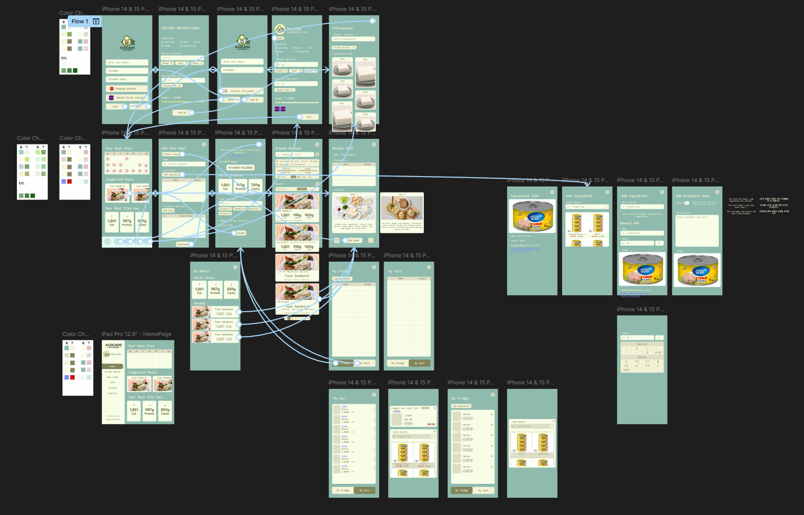

# Avocado Kitchen - A Smart Meal Plan App

This application allows the user to manage their weekly meal plan, and algorithmically formulates plans based on nutrition, user diet restrictions, and adjustable budget. Users can create and upload their own recipes to a community, where other users can like, comment, and download/modify the recipe for themselves. The application also automatically tracks recipe ingredients and, with the user's permission, auto-orders them from South Korea's Coupang and MarketKurly online stores. 

## Periods of Development  
- April 23, 2022 - Present

## Development Environment  
- 'NodeJS, React Native, TailwindCSS, Python' 
- 'Database: Google Firebase'

## Figma Pre-Design

A majority of the current progress was spent on developing the front-end application for usability, navigability, and aesthetics. 

The initial designs of each major page were drafted on Figma, where aspects like the color palette, page layout, and general navigation was experimented. More pages were added throughout the process as the app expanded in functionality and pages. 

   
   

Note that a large portion of the general navigation and widgets were edited during front-end development. The [Figma link](https://www.figma.com/design/Eqfgi0TAOecSLGTEpJMXLM/Meal-Plan-App?node-id=0-1&p=f&t=kHnIiwVHbvht7x5v-0) is provided if more in-depth exploration is desired. 

## Front-End Development

Add Korean Support Info

### Login/SignUp Page

### Profile/Settings Page

### HomePage

### Meal Page

### Add Meal Page

### Recipe Search Page

### My Cart Page
